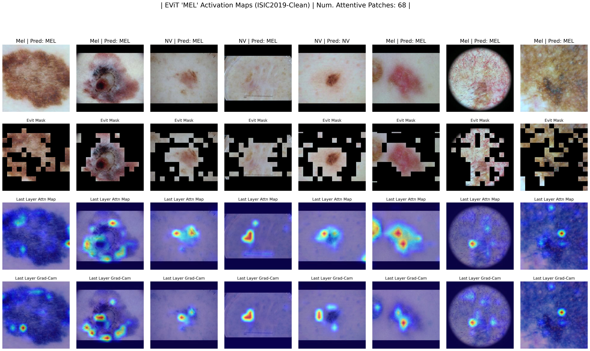

# Medical EViT: Enhanced Vision Transformer for Medical Image Processing

## Introduction

This repository presents Medical EViT, an adaptation of the Enhanced Vision Transformer (EViT) for the specific domain of medical image processing. Our work focuses on tailoring the EViT architecture for improved performance in breast and skin cancer detection.

The original EViT model, developed by [Liang et al.](https://github.com/youweiliang/evit), has shown remarkable capabilities in general image processing tasks. Building upon their foundation, we have fine-tuned the architecture to better suit the nuances and requirements of medical images.

## Adaptation for Medical Image Processing

Medical images, such as mammograms and dermoscopic images, present unique challenges due to their intricate patterns and the subtleties involved in disease manifestation. Our adaptation, Medical EViT, incorporates domain-specific enhancements to address these challenges, providing a more sensitive and accurate model for medical professionals.

The Medical EViT provides a patch based analysis of the medical images. For example:



## Acknowledgments

We extend our gratitude to [Liang et al.](https://github.com/youweiliang/evit) for their pioneering work on EViT. This project is a fork of the original EViT repository, with specialized modifications for medical applications.

## Usage

To use Medical EViT for breast or skin cancer detection, follow these steps:

1. **Clone the Repository**
    - Clone this repository to your local machine to get started.
    ```bash
    git clone <repository-url>
    ```

2. **Set Up the Environment**
    - Follow the installation instructions to set up the necessary environment and dependencies.

3. **Operational Modes**
    - Medical EViT supports various modes of operation, catering to different stages of model usage and analysis:

        **Training**
        - To train the model from scratch on your dataset.
        ```bash
        python main.py --mode train --dataset <your-dataset>
        ```

        **Fine-Tuning**
        - To fine-tune the pre-trained model on a specific dataset.
        ```bash
        python main.py --mode finetune --pretrained <path-to-pretrained-model> --dataset <your-dataset>
        ```

        **Testing**
        - To evaluate the model's performance on a test dataset.
        ```bash
        python main.py --mode test --checkpoint <path-to-model-checkpoint> --dataset <test-dataset>
        ```

        **Visualizing Attention Maps**
        - To visualize the attention maps using different visualization techniques, highlighting how the model focuses on different parts of the image.
        ```bash
        python main.py --mode visualize --checkpoint <path-to-model-checkpoint> --dataset <visualization-dataset>
        ```

    Replace `<repository-url>`, `<your-dataset>`, `<path-to-pretrained-model>`, `<path-to-model-checkpoint>`, and `<visualization-dataset>` with the actual values relevant to your project.

## Contribution

Contributions to this repository are welcome. Please fork the repository, make your changes, and submit a pull request for review.

For more detailed information on Medical EViT and its applications in cancer detection, please refer to our academic papers and documentation within this repository.

